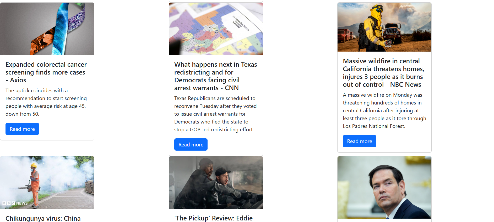

# 📰 News App

A simple and responsive News App built using **JavaScript**, **HTML**, and **Bootstrap**. It fetches real-time news headlines from the [NewsAPI.org](https://newsapi.org) and displays them in a card-based layout.

## 🌟 Features

- Fetches latest top headlines from the USA
- Responsive and clean Bootstrap layout
- Dynamic rendering of news articles
- Read more button with links to original articles
- Modular file structure with MVC approach (Model-View-Controller)

## 📸 Screenshots

 <!-- Optional: Add a preview image in your repo -->

## 🔧 Technologies Used

- HTML5
- CSS3
- Bootstrap 5
- JavaScript (ES6+)
- [NewsAPI.org](https://newsapi.org)

## 📂 Folder Structure
news-app/
├── index.html
├── styles.css
├── scripts/
│ ├── controllers/
│ │ └── news-controller.js
│ ├── models/
│ │ └── news.js
│ ├── services/
│ │ ├── api-client.js
│ │ └── news-service.js
│ └── utils/
│ └── config.js

bash
Copy
Edit

## 🚀 Getting Started


```bash

1. Clone the repository
git clone https://github.com/Rishita-Paliwal/news-app.git
cd news-app
2. Add your API key
Replace the placeholder API key in scripts/utils/config.js with your own key from NewsAPI.org:

js
Copy
Edit
export const URL = 'https://newsapi.org/v2/top-headlines?country=us&apiKey=YOUR_API_KEY';
3. Run Locally
You can open index.html directly in the browser or use a local server (like VS Code Live Server) for better results.


